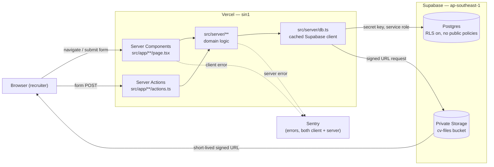

# 01 — Codebase Overview

Scope: `main` branch, commit `ac6ccfe`, as of 2026-09-19. All findings are grounded in the code; no README or comment claims are taken at face value.

## Tech stack

| Layer | What's actually in use | Evidence |
|---|---|---|
| Language/runtime | TypeScript 5, Node 22.x pinned | [package.json:1-52](../package.json), [.nvmrc](../.nvmrc) — `engines.node` = `"22.x"` |
| Framework | Next.js 16.3.5, App Router, React 19.2.8 | [package.json:20,26-27](../package.json) |
| Front end | Server Components by default; client components opt in with `"use client"`. No SPA router, no separate front-end app. | e.g. [src/app/jobs/page.tsx:10](../src/app/jobs/page.tsx), [src/components/patterns/AppNavigation.tsx:1](../src/components/patterns/AppNavigation.tsx) |
| CSS | Tailwind CSS v4 (`@import "tailwindcss"`), shadcn/ui (`style: "base-nova"`), custom design tokens as CSS variables | [src/app/globals.css:1-103](../src/app/globals.css), [components.json](../components.json) |
| Database | Supabase Postgres, accessed only via `@supabase/supabase-js` with the secret key, server-side | [src/server/db.ts:1-26](../src/server/db.ts) |
| Search | PGroonga keyword search via a Postgres RPC (`search_candidates`) — no embeddings/vector search wired up despite a `vector` extension and `embeddings` table existing in the schema (see [02](02-improvement-recommendations.md) #7) | [src/server/search/query.ts:53-72](../src/server/search/query.ts) |
| File storage | Supabase Storage, private `cv-files` bucket, short-lived signed URLs | [src/server/storage.ts:59-100](../src/server/storage.ts) |
| Monitoring | Sentry (`@sentry/nextjs`), client + server + edge configs | [sentry.server.config.ts](../sentry.server.config.ts), [src/instrumentation.ts](../src/instrumentation.ts) |
| Testing | Vitest (unit + DB integration), Playwright (e2e, desktop + phone projects) | [vitest.config.ts](../vitest.config.ts), [playwright.config.ts](../playwright.config.ts) |
| CI | GitHub Actions: PR checks, DB integration, e2e against Vercel previews, migration promotion, seed | [.github/workflows/*.yml](../.github/workflows) |
| Package manager | npm | [package-lock.json](../package-lock.json) |

There is **no authentication system** — the app has no sign-in. Recruiter identity is a typed name remembered per device (`localStorage`), used only for audit trails. This is a deliberate MVP decision, not a gap — see [src/lib/recruiter-name.ts](../src/lib/recruiter-name.ts) and CLAUDE.md hard rule 8.

## Folder structure

```
src/
  app/                Next.js App Router routes. Each route folder holds page.tsx
                       and, where the page has forms, colocated Server Actions
                       (actions.ts).
  components/
    ui/                Low-level shadcn primitives (button, dialog, sheet only — see 02 #6)
    patterns/           Shared cross-page components (AppShell, AppNavigation,
                        DelayStatusBadge, TypedNameDialog)
    features/           One folder per feature area (dashboard, jobs, cv-processing,
                        gap-check, placements, search), each holding the client
                        component(s) a page renders
  server/               All Supabase access and business logic. Organised by
                       domain (cv/, jobs/, pipeline/, placements/, search/,
                       gap-check/, dashboard/). Imports "server-only" to fail
                       the build if pulled into a client bundle.
  lib/                  Pure, environment-agnostic helpers shared by both server
                       and client code (working-days math, stage rules, security
                       headers, env parsing)
supabase/
  migrations/            Hand-written, timestamped SQL migrations (18 files)
  tests/                 DB integration tests (RLS, holidays, search, storage)
design/
  *.pen, tokens.md, specs/*.md   pen.dev design source files and their generated
                                 Markdown mirrors — the actual design system source
                                 of truth (see 02 and 03)
docs/
  decisions/ (ADRs), plans/, tasks/<issue>-<slug>/, ux/, security/, compliance/
e2e/                     Playwright specs, one per key screen
test/                    Vitest setup, shared fixtures, stub for the `server-only` package
scripts/                 seed, db-types, bundle-check scripts
```

## Architecture

Straight Next.js App Router request flow — no separate API/controller layer, no ORM. Pages are async Server Components that call functions in `src/server/**` directly; those functions call Supabase via one cached `SupabaseClient`. Interactive pages colocate a `"use server"` Server Action file next to `page.tsx` for writes.



No email, no external identity provider, no product-AI/model calls anywhere in `src/` (verified by grep — see [02](02-improvement-recommendations.md) #7). The only outbound integrations are Supabase and Sentry.

## Main features (implemented, by evidence)

| Feature | Where |
|---|---|
| Dashboard: overdue / due-soon / guarantee-ending, filterable | [src/server/dashboard/data.ts](../src/server/dashboard/data.ts), [src/components/features/dashboard/Dashboard.tsx](../src/components/features/dashboard/Dashboard.tsx) |
| Job creation + requirement flags (must-have/nice-to-have), gap-flag checklist | [src/components/features/jobs/JobForm.tsx](../src/components/features/jobs/JobForm.tsx), [src/components/features/gap-check/FlagChecklist.tsx](../src/components/features/gap-check/FlagChecklist.tsx) |
| Candidate profile, CV parsing review/override, original CV link via signed URL | [src/components/features/cv-processing/CandidateProfile.tsx](../src/components/features/cv-processing/CandidateProfile.tsx) |
| Keyword + filter candidate search, job-scoped search | [src/components/features/search/SearchScreen.tsx](../src/components/features/search/SearchScreen.tsx), [JobScopedResults.tsx](../src/components/features/search/JobScopedResults.tsx) |
| Placement tracking + guarantee-period flags | [src/components/features/placements/Placements.tsx](../src/components/features/placements/Placements.tsx) |
| Pipeline stage moves with typed-name audit (built, not yet surfaced in any page — `/jobs/[id]` shows a "Coming in a later phase" placeholder) | [src/app/jobs/[id]/pipeline-move-actions.ts](../src/app/jobs/[id]/pipeline-move-actions.ts), [src/app/jobs/[id]/page.tsx:106-110](../src/app/jobs/[id]/page.tsx) |
| Settings | placeholder only — [src/app/settings/page.tsx](../src/app/settings/page.tsx) |

There are no "users and roles" beyond the single implicit "recruiter" — no admin area, no candidate-facing pages. This matches CLAUDE.md ("no sign-in in the MVP").

## Page inventory

This table is the fixed scope for Phase 3.

| Route / URL | Template or component file | Purpose | Used by |
|---|---|---|---|
| `/` | [src/app/page.tsx](../src/app/page.tsx) | Redirects to `/dashboard` | Recruiter |
| `/dashboard` | [src/app/dashboard/page.tsx](../src/app/dashboard/page.tsx) → [Dashboard.tsx](../src/components/features/dashboard/Dashboard.tsx) | "What needs attention today": overdue, due-soon, guarantee-ending, with client/job/stage/owner filters | Recruiter |
| `/jobs` | [src/app/jobs/page.tsx](../src/app/jobs/page.tsx) | Table of all jobs with status, owner, open gap-flag count, pipeline count | Recruiter |
| `/jobs/new` | [src/app/jobs/new/page.tsx](../src/app/jobs/new/page.tsx) → [JobForm.tsx](../src/components/features/jobs/JobForm.tsx) | Create a job: title, client, owner, must-have/nice-to-have requirements, nationality/language justification | Recruiter |
| `/jobs/[id]` | [src/app/jobs/[id]/page.tsx](../src/app/jobs/[id]/page.tsx) → [FlagChecklist.tsx](../src/components/features/gap-check/FlagChecklist.tsx) | Job detail: requirements, open gap flags, link to job-scoped search. Pipeline board section is a placeholder. | Recruiter |
| `/candidates/[id]` | [src/app/candidates/[id]/page.tsx](../src/app/candidates/[id]/page.tsx) → [CandidateProfile.tsx](../src/components/features/cv-processing/CandidateProfile.tsx) | Candidate profile: parsed fields, field overrides, stage history, original CV link | Recruiter |
| `/placements` | [src/app/placements/page.tsx](../src/app/placements/page.tsx) → [Placements.tsx](../src/components/features/placements/Placements.tsx) | Post-placement follow-up list with guarantee-period flags | Recruiter |
| `/search` | [src/app/search/page.tsx](../src/app/search/page.tsx) → [SearchScreen.tsx](../src/components/features/search/SearchScreen.tsx) / [JobScopedResults.tsx](../src/components/features/search/JobScopedResults.tsx) | Keyword + filter candidate search; scoped to a job when `?jobId=` is present | Recruiter |
| `/settings` | [src/app/settings/page.tsx](../src/app/settings/page.tsx) | Placeholder — "arrives with its owning screen Story" | Recruiter |
| `/sentry-test` | [src/app/sentry-test/page.tsx](../src/app/sentry-test/page.tsx) | Internal-only page that throws a client error to verify Sentry wiring. Disabled in production (`notFound()` when `VERCEL_ENV === "production"`). | Engineering, not recruiters |

`GET /api/sentry-test` ([src/app/api/sentry-test/route.ts](../src/app/api/sentry-test/route.ts)) is an API route, not a page — included here for completeness, excluded from Phase 3 page scope.

**9 recruiter-facing pages + 1 internal debug page.** `/settings` and the pipeline board on `/jobs/[id]` are unfinished features, not modernisation targets — Phase 3 will restyle their current (minimal) markup without adding the missing functionality.

## Current setup: tests, build, deployment

**Tests** — run against the pinned Node version (22.23.2 via `.nvmrc`):

| Suite | Command | Result (this run) |
|---|---|---|
| Unit (Vitest) | `npm test` | **310/310 passed**, 44/44 files |
| Lint (ESLint) | `npm run lint` | **0 errors, 2 warnings** in the tracked tree (both `no-unused-vars` on intentionally-unused destructured values — [src/server/gap-check/missing-fields.test.ts:241](../src/server/gap-check/missing-fields.test.ts), [supabase/migration-lint.ts:113](../supabase/migration-lint.ts)) |
| Typecheck | `npm run typecheck` | **Clean** |
| DB integration (`test:db`) | `npm run test:db` | Not run — requires Docker/local Supabase, out of scope per this machine's setup (see memory: no Docker locally) |
| e2e (Playwright) | `npm run test:e2e` | Not run in Phase 1 — requires a running app; will be exercised in Phase 3 verification |
| Build | `npm run build` | Not run in Phase 1 — `next/font/google` fetches fonts at build time, which is a network call; skipped per the "ask before touching the network" rule |

⚠️ **Environment note, not a code bug**: running `npm test` under the machine's default Node (20.19.4, active via nvm) produces 6 spurious failures — a Supabase Realtime "native WebSocket not found" error in [src/server/db.test.ts](../src/server/db.test.ts) and four empty-string PDF-extraction failures in [src/server/cv/extract.test.ts](../src/server/cv/extract.test.ts). Both disappear under Node 22, which is what `.nvmrc` and CI ([.github/workflows/pr-checks.yml:20-23](../.github/workflows/pr-checks.yml)) actually use. Recorded as a minor DX finding in [02](02-improvement-recommendations.md) #9, not as a broken test suite.

227+ `it()`/`test()` blocks across `src/` alone (44 test files), plus 6 DB integration test files under `supabase/tests/` and 9 Playwright specs under `e2e/`.

**Build** — `npm run build` runs `next build` then [scripts/check-client-bundle.mjs](../scripts/check-client-bundle.mjs), which fails the build if the Supabase secret key ever reaches the client bundle.

**Deployment** — Vercel, functions pinned to `sin1` (Singapore) per `vercel.json`/CLAUDE.md; Supabase project in `ap-southeast-1`. CI pushes migrations to the shared Preview/Production Supabase project only on merge to `main`, behind a required-reviewer GitHub Environment ([.github/workflows/migrate.yml](../.github/workflows/migrate.yml)). No production deploy pipeline exists yet beyond Vercel's own git integration — not verified further as that lives outside this repo.
