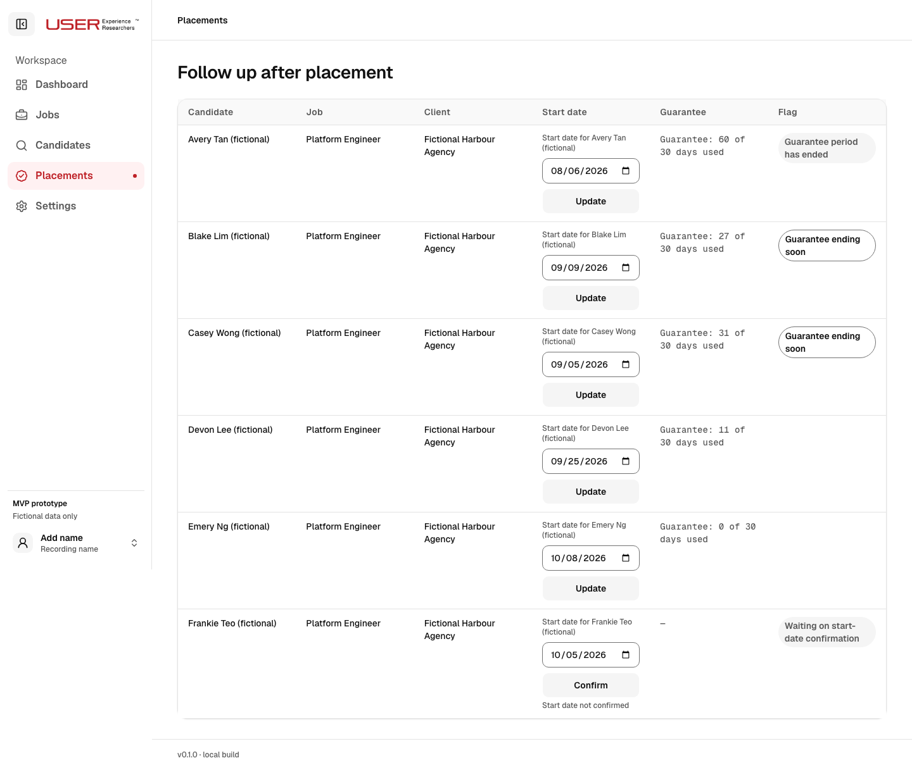
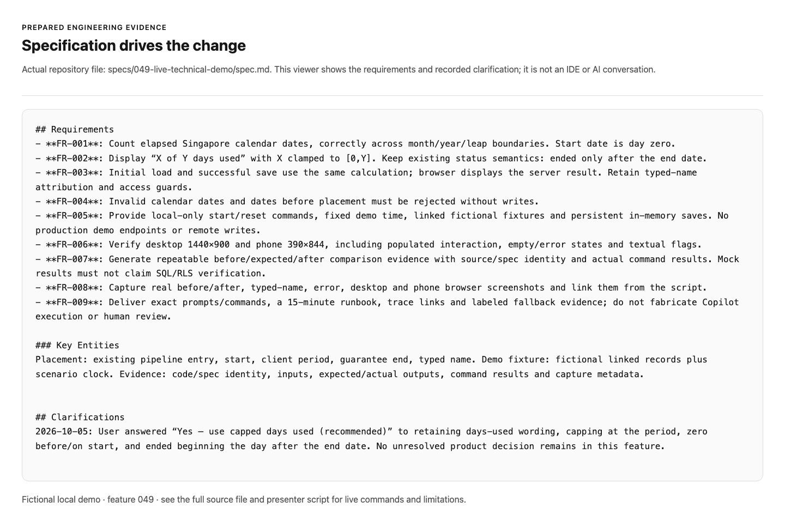
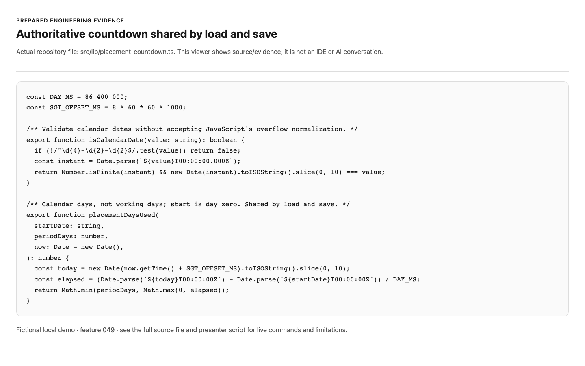
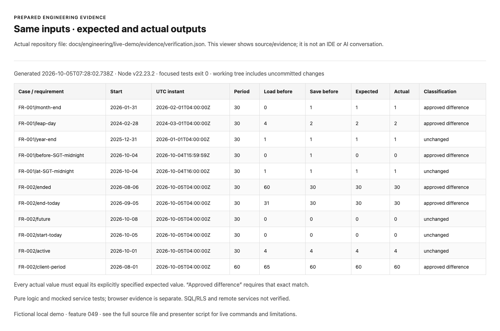
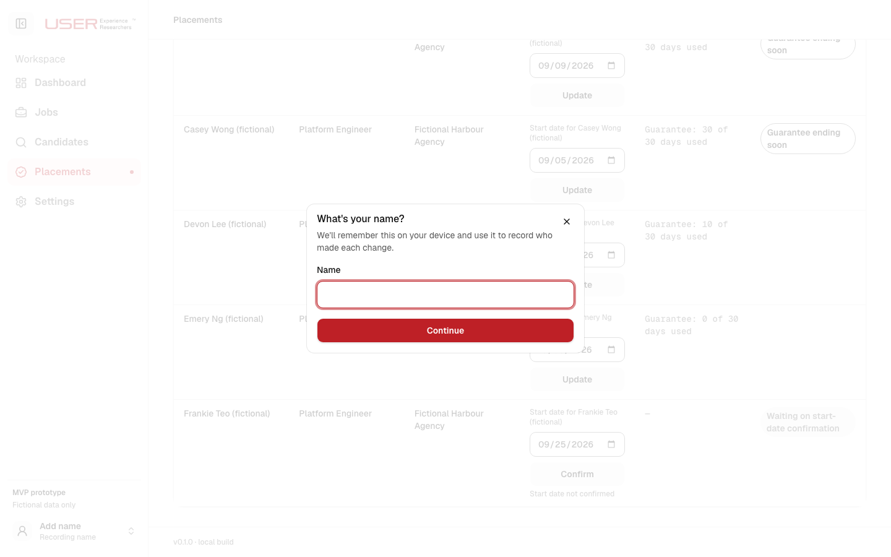
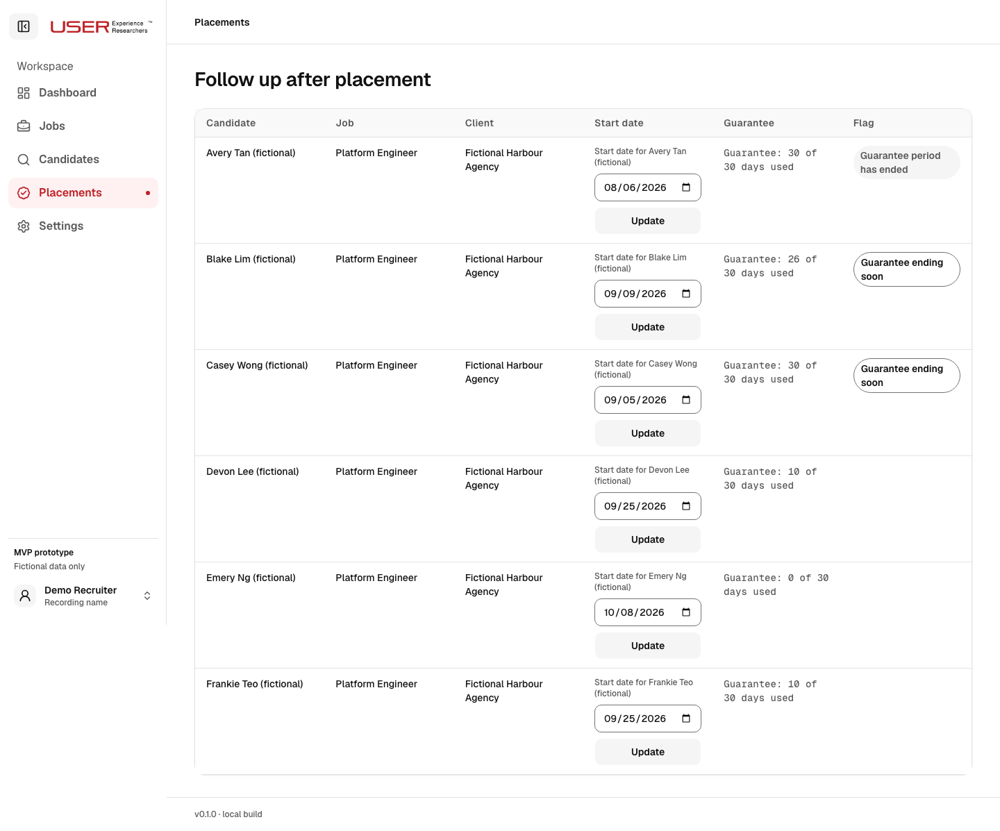
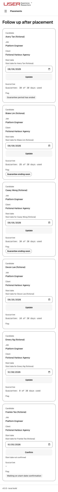
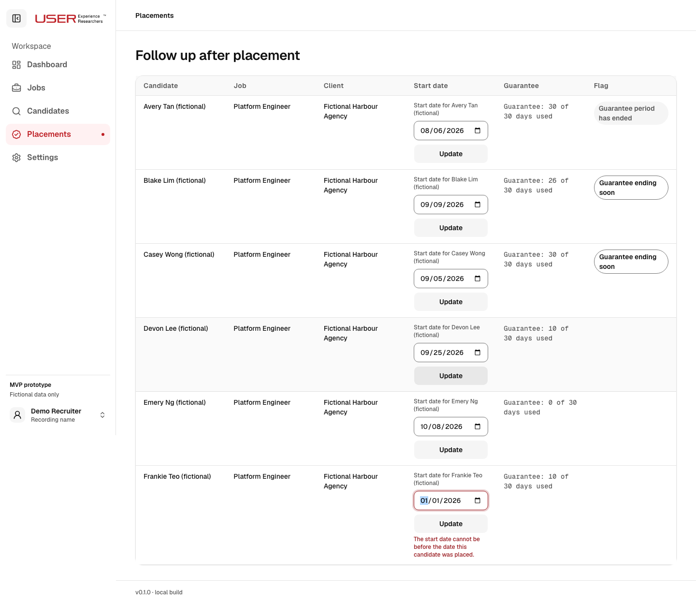
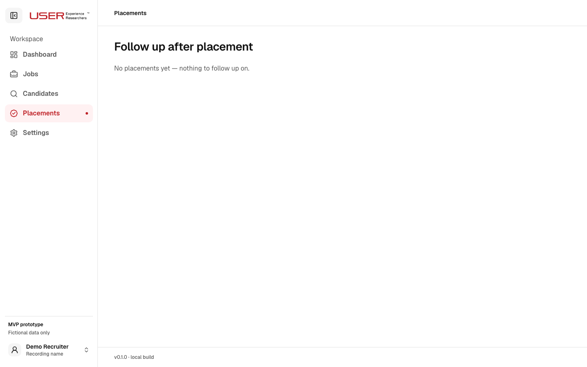

# Fifteen-minute technical demo script

Demonstrate one business rule from evidence to specification, a bounded implementation, and verified behaviour. The countdown now consistently counts Singapore calendar dates and displays capped days used. The owner chose the display rule; the engineer reviewed the arithmetic, service boundary and tests.

This script covers the **15 minutes of hands-on technical work**. Start the clock with the local app authenticated and the IDE, terminal, specification and evidence ready. It contains actual browser screenshots captured during preparation. Prepared images and reports are labeled; they are not a record of a live Copilot session.

## Prepare before starting the clock

1. Use Node 22 and run `npm run demo:start` in terminal A. Keep it running. It builds before the timed demo and uses **127.0.0.1:3100**, leaving the existing port-3000 app alone.
2. Open http://127.0.0.1:3100/login. Use fictional `recruiter@example.test`, then mock code `001234`. No mail is sent. Open `/placements`.
3. In terminal B, run `npm run demo:reset` and `npm run demo:verify`. Reload the page. The fixed scenario is **5 October 2026, 12:00 Singapore**.
4. Run `npm run demo:rehearse`. It prints a temporary exercise directory and an exact Vitest command. Open its spec, historical helper and tests in VS Code. Run the command once before rehearsal to confirm the expected failure. Create a fresh exercise for the actual timed run.
5. Have these tabs ready: [before screenshot](screenshots/before-desktop.png), [specification](../../../specs/049-live-technical-demo/spec.md), [live prompts](prompts.md), the exercise's `placement-countdown.ts`, and [verification report](evidence/verification.md).
6. Full lint, typecheck, unit, build and both-width browser checks are preflight checks. Do not spend the timed demo building/installing or running the entire suite.

The app is already corrected. The coding portion uses an isolated exercise derived from the actual historical formula and the same spec cases. Say this explicitly. After the edit, show the real integrated app and service wiring. Do not revert the shared working tree or present a completed app as a new live integration.

## 0:00–3:00 Analyse current-state evidence

**Show:** the retained before screenshot, then the original formulas and comparison inputs. The screenshot is a real pre-fix render of the same fictional records, not an edited mockup.



**Say:** “This is the original application captured before the change. Avery has 60 elapsed days for a 30-day guarantee. The page says 60 of 30. The saved calculation capped that value, so loading and saving could produce different results. I will trace the rule and distinguish that evidence from what the product should do.”

Run in terminal B:

```sh
npm run demo:baseline
```

**Expected:** the preserved historical formulas are compared with explicit expected values; the command exits **1 intentionally** because some original outputs violate the approved specification. It does not revert or modify the current app. Jan 31 → Feb 1 has original load 0 and expected 1; ended guarantee has original load 60 and expected 30. The before-Singapore-midnight case also exposes the original rounded UTC save calculation.

Paste [Analyse prompt](prompts.md#1-analyse--read-only). Inspect its citations against `scripts/demo/baseline.ts`, not against memory.

**Say:** “The old helper passed an ISO month directly to Date.UTC, whose month is zero-based. Separately, the client rounded a UTC interval. Those are implementation findings. Capping after expiry is a product choice, which I asked the owner to decide.”

**Boundary at 3:00:** move to the specification even if AI analysis is slow. Fallback: the actual [research findings](../../../specs/049-live-technical-demo/research.md), [pre-fix failing test output](evidence/red-tests.txt), and baseline matrix.

## 3:00–5:30 Specify expected and preserved behaviour

**Show:** feature 049's spec and the copied spec in the exercise. Open FR-001, FR-002 and the recorded clarification.



**Say:** “The owner approved days-used wording capped at the client's period. The start is day zero; a future start also shows zero. The existing flag becomes ended only after the end date. These expected outputs guide both the implementation and the tests.”

Point to the explicit cases:

| Input | Required output | Why |
| --- | --- | --- |
| Jan 31 → Feb 1, 30-day period | 1 | Correct calendar boundary |
| 60 elapsed days, 30-day period | 30 | Approved cap |
| Future start | 0 | Approved lower bound |
| Just before Singapore midnight | 0 | No rounding of partial UTC days |
| At Singapore midnight | 1 | Singapore date crossed |
| Non-default 60-day period, 65 elapsed | 60 | Client period remains authoritative |

Paste [Specify prompt](prompts.md#2-specify--bounded-refinement). Review any actual wording refinement in the exercise's spec. If the scenario is already clear, explain it without manufacturing a revision.

**Say:** “The five-working-day warning is a separate rule. It stays unchanged. The scope is the calendar count, its approved display and load/save agreement.”

**Boundary at 5:30:** acceptance cases must be visible. Fallback: open the prepared spec directly. The owner decision was made during preparation, not invented on stage.

## 5:30–10:30 Implement from the spec with Copilot

**Show:** the isolated exercise created by `demo:rehearse`. It contains the preserved formula, explicit cases and spec-derived tests. Use the exact command printed by the setup, for example:

```sh
npm exec -- vitest run --config /path/printed/by/demo-rehearse/vitest.config.mts
```

**Say:** “This isolated exercise starts from the historical initial-load formula. It uses the same approved examples as the working application. The regression fails before implementation. Copilot is supplied with the spec, cases, test and this one file.”

Paste [Implement prompt](prompts.md#3-implement--isolated-exercise). Inspect the actual generated diff before accepting it. Check Singapore date conversion, month/leap handling, zero/cap bounds and the client period. Explain one real review decision; do not invent a defect or rejection for the demonstration.

Run the exercise tests again. **Expected:** all 11 cases pass. Inspect the generated diff using the command in the exercise README.

Then briefly open the real integration:

- `src/server/placements/list.ts` calls `placementDaysUsed` on load.
- `src/server/placements/create.ts` adds authoritative `daysUsed` to the save response.
- `src/components/features/placements/Placements.tsx` displays that server value after saving.



**Say:** “A shared function alone would still allow two clocks to disagree. The server calculates the result on load and save; the browser consumes that result. Input validation also rejects impossible calendar dates before a write.”

**Boundary at 10:30:** move to verification. If the AI/edit stalls, open the actual prepared helper and passing test result. State that it is preparation evidence and that the live exercise has not completed.

## 10:30–15:00 Verify behaviour and trace the evidence

### 10:30–12:00 Run consistency and focused checks

Run:

```sh
npm run demo:verify
```

**Expected:** exit 0; all 11 outputs match the independently specified expected values; focused service/logic tests pass. Open [the generated report](evidence/verification.md).



**Say:** “A changed output passes only if it matches the spec exactly. A criterion ID does not make any difference acceptable. January's boundary and the expired cap are approved differences; a normal four-day count stays unchanged. This covers the enumerated cases, not every possible system behaviour.”

### 12:00–13:30 Save and reload in the actual app

Open `/placements`. Avery now shows **30 of 30**; Casey is **30 of 30** with “Guarantee ending soon” because the end date is today. Devon shows **10 of 30**; Emery shows **0 of 30** because the start is future.


For Frankie Teo (fictional), enter **2026-09-25** and click **Confirm**. On first use, type **Demo Recruiter** in the name dialog and choose **Continue**. If the name is already remembered, the save continues using the established behaviour. Use a fresh private browser session during preflight if you need to demonstrate first use; do not modify auth guards.



**Expected:** Frankie displays **10 of 30 days used**. Reload the page: the start date and count persist.



**Say:** “This invokes the real Server Action against the local fictional provider. Typed-name attribution is retained. The save response and subsequent load agree.”

### 13:30–14:30 Follow one complete trace

| Finding | Requirement/scenario | Implementation | Verification | Result |
| --- | --- | --- | --- | --- |
| F-001: wrong month conversion | [FR-001 / US1 scenario 1](../../../specs/049-live-technical-demo/spec.md) | [placementDaysUsed](../../../src/lib/placement-countdown.ts) and [list integration](../../../src/server/placements/list.ts) | [month-end test](../../../src/lib/placement-countdown.test.ts), [load regression](../../../src/server/placements/list.test.ts) | [before/expected/actual evidence](evidence/verification.md) |
| F-002: load/save count disagreement | [FR-002 and FR-003](../../../specs/049-live-technical-demo/spec.md) | [save response](../../../src/server/placements/create.ts), [client consumption](../../../src/components/features/placements/Placements.tsx) | [service tests](../../../src/server/placements/create.test.ts), [save/reload browser test](../../../e2e/placements.spec.ts) | [focused output](evidence/focused-tests.txt), saved/reloaded screenshot |
| F-003: missing populated and phone checks | [FR-005 and FR-006](../../../specs/049-live-technical-demo/spec.md) | [local fixtures](../../../e2e/placement-fixtures.mjs) | [desktop/phone e2e](../../../e2e/placements.spec.ts) | [feature verification](../../../specs/049-live-technical-demo/verification.md), phone capture below |

### 14:30–15:00 State the result and limits

**Say:** “The approved date cases pass, load/save/reload agree, and the phone interaction is covered. We used a real application with fictional local data. SQL/RLS, private storage and production services require separate verification. AI proposed changes; the engineer checked the spec, diff and actual results.”

Finish at **15:00**. Keep phone, invalid-save and empty-state images for technical questions, rather than using the final minute for another product tour.

## Real screenshot backup for questions

All images below are direct browser captures. The backend is the local fictional provider; the application UI and Server Actions are real. Capture manifests identify viewport, scenario time, file hashes and source state.

### Phone layout and interaction



[Typed-name phone capture](screenshots/typed-name-phone.png) · [Saved/reloaded phone capture](screenshots/saved-reloaded-phone.png)

### Rejected save preserves input



[Phone validation capture](screenshots/validation-phone.png). The tests also inject a local provider failure and confirm feedback/input preservation; the provider control is absent from application routes.

### Empty state



[Phone empty state](screenshots/empty-phone.png).

## Recovery and rehearsal

Use at most 30 seconds to recover within a step, then switch to its prepared artifact and identify it as prepared. Respect the 3:00, 5:30 and 10:30 transitions so verification stays inside the demo. Aim for 14 minutes in rehearsal with one minute spread across steps for recovery.

The automated run proves commands, cases and UI flows; it does not prove human speaking duration or Copilot availability. Rehearse twice on the actual laptop, including an AI/network failure. Record actual durations and real AI review decisions. See [prompts.md](prompts.md) for the material inputs, outputs and human checks at every stage.
