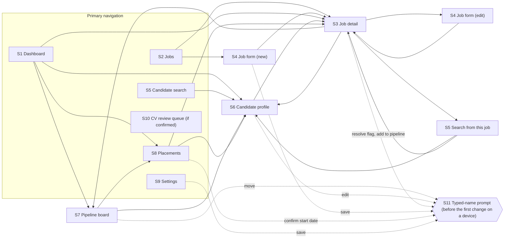

# Screen inventory and navigation map

## Status

**Accepted** · 2026-09-17 · created by [#75](https://github.com/dczii/URecruitment/issues/75)
(story [#21](https://github.com/dczii/URecruitment/issues/21), epic
[#1](https://github.com/dczii/URecruitment/issues/1))

This record maps the portal's information architecture **before** any pen.dev work starts. It covers
every screen the MVP needs, how recruiters move between them on a desktop and on a phone, and the
rules every screen design must visibly follow. The three core journeys are in [flows.md](flows.md).

It is structure, not design. It fixes **what** each screen is for and **where it sits**. It does not
fix how anything looks: tokens belong to [#94](https://github.com/dczii/URecruitment/issues/94), the
shell to [#96](https://github.com/dczii/URecruitment/issues/96), the shared patterns to
[#98](https://github.com/dczii/URecruitment/issues/98) and each screen to its own design task below.
A design task that needs to depart from this map says so in its spec and updates this file in the
same PR.

**Sources.** PRD *UI design → MVP screens* (the nine screens: **decided**) and *Design rules 1–5*
(**proposed**); `prd-context` → `references/screens.md`; the `ui-design` and `ui-build` skills; the
E02 design tasks and the build tasks that name each route. PRD status words follow
[../decisions/README.md](../decisions/README.md).

## Design rules every screen must show

These are the PRD's five design rules (**proposed**), stated as constraints a design review can
check. Two of them are also `CLAUDE.md` hard rules, which makes them binding whatever their PRD status.

| # | PRD rule (verbatim) | Constraint on every screen design | Screens where it bites |
|---|---|---|---|
| R1 | *"Every AI result is labelled as a suggestion and shows the text it came from."* | Every AI-derived value (a score, a matched, missing or uncertain skill, a gap flag, a parsed field, a search interpretation) carries a visible **"AI suggestion"** label and an expandable **source quote**. Scores also show the **model version and date**. Nothing looks like an automatic decision. `CLAUDE.md` hard rules 1 and 4 | Job detail, Candidate search, Candidate profile, Job form (JD pre-fill) |
| R2 | *"Delay status uses a word or icon as well as colour, so it doesn't rely on colour alone."* | A delay status is always **icon + word + colour** ("On track", "Due soon", "Overdue · 3 days"). It stays legible in greyscale. End states and Placed show **no** status | Dashboard, Pipeline board, Job detail, Jobs |
| R3 | *"The type stack includes a font with Simplified Chinese characters, such as Noto Sans SC."* | Every frame that shows candidate or job text includes at least one **Simplified Chinese** example (name, employer or quote), rendered in the SC face and truncated without cutting a character | Every screen that shows candidate or job text |
| R4 | *"The dashboard and pipeline board are fully usable at phone width."* | The Dashboard and Pipeline board have a **phone frame designed as a first-class layout** (390 px), where every action is reachable with no horizontal page scroll. Other screens also get a phone frame and must not break, but may be simplified | Dashboard, Pipeline board (strict); all others (must not break) |
| R5 | *"Before a recruiter's first change on a device, the portal asks for their name."* | Any control that changes data (a stage move, a profile edit, a flag resolve or dismiss, a settings change, a job save) is designed with the **name-prompt** path for first use. A stage move also shows the remembered name with a "not you?" option. `CLAUDE.md` hard rule 8 | Every screen with a change action |

And from the rest of the PRD, a rule every screen inherits: **times are shown in Singapore time**
(`CLAUDE.md` hard rule 7). A relative age ("CV updated 8 months ago") always has the absolute date
available.

## Screens at a glance

Nine screens come from the PRD. Two more are implied by the requirements but are **not** in the PRD
list, and both need the **product owner's confirmation**. They are tracked as
[RC-2](../decisions/open-questions.md#rc-2--screens-implied-by-the-requirements) in the open-questions
register.

| # | Screen | In PRD list | Proposed route | Owning design task | Build task(s) |
|---|---|---|---|---|---|
| S1 | Dashboard | yes | `/dashboard` (and `/` redirects there) | [#100](https://github.com/dczii/URecruitment/issues/100) | [#161](https://github.com/dczii/URecruitment/issues/161) |
| S2 | Jobs | yes | `/jobs` | [#101](https://github.com/dczii/URecruitment/issues/101) | [#137](https://github.com/dczii/URecruitment/issues/137) |
| S3 | Job detail | yes | `/jobs/[id]` | [#101](https://github.com/dczii/URecruitment/issues/101) | [#137](https://github.com/dczii/URecruitment/issues/137), [#144](https://github.com/dczii/URecruitment/issues/144), [#151](https://github.com/dczii/URecruitment/issues/151) |
| S4 | Job form | yes | `/jobs/new`, `/jobs/[id]/edit` | [#102](https://github.com/dczii/URecruitment/issues/102) | [#135](https://github.com/dczii/URecruitment/issues/135), [#139](https://github.com/dczii/URecruitment/issues/139) |
| S5 | Candidate search | yes | `/search` (job-scoped: `/search?job=[id]`) | [#103](https://github.com/dczii/URecruitment/issues/103) | [#154](https://github.com/dczii/URecruitment/issues/154), [#155](https://github.com/dczii/URecruitment/issues/155) |
| S6 | Candidate profile | yes | `/candidates/[id]` | [#103](https://github.com/dczii/URecruitment/issues/103) | [#134](https://github.com/dczii/URecruitment/issues/134), [#133](https://github.com/dczii/URecruitment/issues/133) |
| S7 | Pipeline board | yes | on Job detail, and `/jobs/[id]/pipeline` | [#104](https://github.com/dczii/URecruitment/issues/104) | [#160](https://github.com/dczii/URecruitment/issues/160) |
| S8 | Placements | yes | `/placements` | [#105](https://github.com/dczii/URecruitment/issues/105) | [#164](https://github.com/dczii/URecruitment/issues/164) |
| S9 | Settings | yes | `/settings` | [#105](https://github.com/dczii/URecruitment/issues/105) | [#165](https://github.com/dczii/URecruitment/issues/165), [#166](https://github.com/dczii/URecruitment/issues/166), [#168](https://github.com/dczii/URecruitment/issues/168) |
| S10 | CV review queue | **no, needs owner confirmation** | `/review-queue` | [#106](https://github.com/dczii/URecruitment/issues/106) | [#131](https://github.com/dczii/URecruitment/issues/131) |
| S11 | Typed-name prompt | **no, needs owner confirmation** | none (a dialog over any screen) | [#98](https://github.com/dczii/URecruitment/issues/98) | [#99](https://github.com/dczii/URecruitment/issues/99), [#167](https://github.com/dczii/URecruitment/issues/167) |

Every screen sits inside the **app shell** (header, navigation, recruiter-name affordance), designed
in [#96](https://github.com/dczii/URecruitment/issues/96) and built in
[#97](https://github.com/dczii/URecruitment/issues/97).

**Routes are proposed.** Most come from the affected-files lists of the build tasks, under the
`src/app/(app)/` route group. Three are new here: `/jobs/[id]/edit`, `/jobs/[id]/pipeline` and the
`?job=` search parameter. The build task that creates a route may rename it and should update this
table.

## Navigation map

### Primary navigation

| Destination | Desktop | Phone (390 px) | Why it is primary |
|---|---|---|---|
| **Dashboard** | Persistent side or top navigation, first item, the landing page | In the navigation sheet, first item; the landing page | *"See what needs attention today"*. It is where the day starts |
| **Jobs** | Persistent | In the sheet | The entry to Job detail, the Job form and the Pipeline board |
| **Candidates** (Candidate search) | Persistent | In the sheet | The entry to Candidate profiles outside a job |
| **Placements** | Persistent | In the sheet | Post-placement follow-up is its own daily task |
| **Settings** | Persistent, last item | In the sheet, last item | Used rarely. Every change here is logged |
| *CV review queue* | *Persistent, with a count of failed files, **if RC-2 confirms it*** | *In the sheet, with the count* | *Only if confirmed. Until then, no nav entry is designed* |

**Not in the primary navigation, on purpose:**

- **Job detail, Job form, Pipeline board.** Each needs a job, so they are reached from Jobs, the
  Dashboard or a candidate's stage history. A top-level "Pipeline" entry with no job would need a job
  picker, and the PRD describes the board as part of working one job (*Job detail → "pipeline
  board"*).
- **Candidate profile.** It needs a candidate.
- **Typed-name prompt.** It is a dialog, not a destination.

> **Reading of #96 and #97.** Both scope *"navigation for the nine MVP areas"*. This record reads
> that as every area being **reachable** from the shell, not as nine top-level links: three areas need
> a job and one needs a candidate. [#96](https://github.com/dczii/URecruitment/issues/96) may revisit
> this, and updates this table if it does. [#97](https://github.com/dczii/URecruitment/issues/97)'s
> navigation test covers the five links above.

**Proposed for [#96](https://github.com/dczii/URecruitment/issues/96), which decides:**

**Desktop:** the navigation is always visible, and the header shows the page title plus the
**recruiter-name affordance** ("Recording as *name* · Change"). On the Job detail and Candidate
profile screens, a breadcrumb shows the path back (Jobs › *job title*).

**Phone:** a top bar with a menu button, the page title and a back control. The primary navigation
opens in a **sheet** (as [#97](https://github.com/dczii/URecruitment/issues/97) scopes it). The
recruiter-name affordance sits at the top of the sheet. Nothing needs a horizontal page scroll.

### Map

Solid arrows are navigation. Dotted arrows mark where a change can open the name prompt.

## Screens

Each entry lists the PRD's key elements (verbatim from *UI design → MVP screens*), what the design
must add to meet the rules above, and how the screen behaves on a phone. **States** means the five
states every design shows (`ui-design`): default, empty, loading, error, and a long-content case.

### S1 — Dashboard

| | |
|---|---|
| Purpose (PRD) | *"See what needs attention today"* |
| Key elements (PRD) | *"Overdue and due-soon candidates, guarantee end dates; filters for client, job, stage and owner"* |
| Also required | Overdue ordered by **days over** with the **"waiting on"** party (pipeline delay rules 3–4, **proposed**); guarantees flagged **5 working days** before they end (**proposed** timing); delays surface **only** here, with no email (**decided**) |
| Entry points | Landing page; primary navigation |
| Leads to | Pipeline board (a candidate's row), Candidate profile, Placements (a guarantee row), Job detail |
| Phone width | **Fully usable (R4).** Sections stack: Overdue, Due soon, Guarantees ending. Rows become cards. The four filters open in a sheet, and an active filter shows as a removable chip. No horizontal page scroll |
| Rules shown | R2 on every row; R3 in a row with a Chinese name; empty sections read as good news ("Nothing overdue") rather than as errors ([#161](https://github.com/dczii/URecruitment/issues/161)) |
| States | All five, plus "filters exclude everything" |
| Design / build | [#100](https://github.com/dczii/URecruitment/issues/100) / [#161](https://github.com/dczii/URecruitment/issues/161) |

### S2 — Jobs

| | |
|---|---|
| Purpose (PRD) | *"Browse all jobs"* |
| Key elements (PRD) | *"Status, owner, open gap flags, candidates per stage"* |
| Also required | A **New job** action leading to the Job form |
| Entry points | Primary navigation |
| Leads to | Job detail; Job form (new) |
| Phone width | The table becomes cards: title, client, owner, status, an open-flag count, and a compact per-stage count. Candidates per stage uses words or numbers, not colour alone |
| Rules shown | R3 (a job with a Chinese title or client) |
| States | All five |
| Design / build | [#101](https://github.com/dczii/URecruitment/issues/101) / [#137](https://github.com/dczii/URecruitment/issues/137) |

### S3 — Job detail

| | |
|---|---|
| Purpose (PRD) | *"Work one job"* |
| Key elements (PRD) | *"Requirements, gap flag checklist with questions for the client, ranked matches with scores and reasons, pipeline board"* |
| Also required | The **job version** being shown ([#137](https://github.com/dczii/URecruitment/issues/137)); a **banner with the count of open gap flags** that says matching still runs (**decided**: *"Open flags don't block matching"*); nationality and language requirements shown **with their written reason** (**decided**); **no AI call on page load** (PRD main flow 2); an **Add to pipeline** action per candidate, with **nothing pre-selected**; an entry to **search from this job**; an **Edit** action leading to the Job form |
| Entry points | Jobs; Dashboard; a candidate's stage history; Placements |
| Leads to | Job form (edit), Pipeline board, Candidate search (job-scoped), Candidate profile |
| Phone width | Sections become tabs or stacked panels: Requirements · Gap flags · Matches · Pipeline. The open-flag banner stays at the top. Match rows become cards with score, label and an expandable reasons panel |
| Rules shown | R1 on every score (with model version and date), every skill claim and every model-derived flag; R2 inside the embedded board; R5 on resolve/dismiss (which also needs a note) and on Add to pipeline |
| States | All five, plus "scores are being recalculated" after a save (re-scoring runs after the response, PRD main flow 3) and "not yet scored for this version" |
| Design / build | [#101](https://github.com/dczii/URecruitment/issues/101) / [#137](https://github.com/dczii/URecruitment/issues/137), [#144](https://github.com/dczii/URecruitment/issues/144), [#151](https://github.com/dczii/URecruitment/issues/151) |

### S4 — Job form

| | |
|---|---|
| Purpose (PRD) | *"Create or edit a job"* |
| Key elements (PRD) | *"Must-have and nice-to-have requirements, job description upload, reason field for nationality or language"* |
| Also required | Owner name and client; an uploaded JD is **read into the same form for the recruiter to confirm** (**decided**); nationality or language **cannot count without a written reason**, enforced in the form and on the server (**decided**); saving creates a **new job version** and runs the gap check (PRD main flow 3) |
| Entry points | Jobs (new); Job detail (edit) |
| Leads to | Job detail, showing the new version and its gap flags |
| Phone width | One column. Requirement rows stack with the must-have / nice-to-have choice on each. The upload is a button (no drag-only target) |
| Rules shown | R1 on every pre-filled value from an uploaded JD, with the JD text it came from, until the recruiter confirms; R5 on save |
| States | All five, plus validation errors, "upload is a scanned file" (rejected with a clear message: no OCR, **decided**) and "pre-filled, awaiting confirmation" |
| Design / build | [#102](https://github.com/dczii/URecruitment/issues/102) / [#135](https://github.com/dczii/URecruitment/issues/135), [#139](https://github.com/dczii/URecruitment/issues/139) |

### S5 — Candidate search

| | |
|---|---|
| Purpose (PRD) | *"Find people"* |
| Key elements (PRD) | *"Plain-language search box, filters, results with CV date"* |
| Also required | The five filters: **skills, years of experience, location, language, CV date** (**proposed**); each result shows **when its CV was last updated** (**proposed**); searching **from a job** ranks by that job's stored match score with the same reasons (**proposed**); the internal database only (**decided**); a query the model could not interpret gets a helpful message ([#154](https://github.com/dczii/URecruitment/issues/154)); protected terms are **never** turned into filters |
| Entry points | Primary navigation (Candidates); Job detail (search from this job) |
| Leads to | Candidate profile; back to Job detail when job-scoped |
| Phone width | The search box is at the top. The five filters open in a sheet. Results are cards showing the CV age with the exact date available |
| Rules shown | R1 on the interpreted query ("searched for: …, as an AI suggestion") and on job-scoped scores; R3 (a ZH query and a ZH result) |
| States | All five, plus "query not understood" and "job-scoped: candidate not yet scored for this version" |
| Design / build | [#103](https://github.com/dczii/URecruitment/issues/103) / [#154](https://github.com/dczii/URecruitment/issues/154), [#155](https://github.com/dczii/URecruitment/issues/155) |

### S6 — Candidate profile

| | |
|---|---|
| Purpose (PRD) | *"Check one person"* |
| Key elements (PRD) | *"Parsed fields with source text, edit mode, original file, stage history"* |
| Also required | Recruiter edits are shown **as differing from the parsed value**, with the parsed value still viewable, and they **survive re-processing** (**proposed**); the original file opens through a **short-lived signed link** requested on demand (`CLAUDE.md` hard rule 3); stage history shows **the typed name and the Singapore date** for each move |
| Entry points | Search results, ranked matches, Pipeline board cards, Dashboard rows, Placements |
| Leads to | Job detail (from a stage-history entry) |
| Phone width | One column. Parsed fields are grouped (Contact, Work history, Education, Skills, Languages). Source quotes expand in place. Edit mode edits one group at a time |
| Rules shown | R1 on every parsed field; R3 (a Chinese CV, with `lang` marked on the quote); R5 on the first edit |
| States | All five, plus a long employer history, 20+ skills, a long Chinese name, and "source not found" for an unverified quote |
| Design / build | [#103](https://github.com/dczii/URecruitment/issues/103) / [#134](https://github.com/dczii/URecruitment/issues/134), [#133](https://github.com/dczii/URecruitment/issues/133) |

### S7 — Pipeline board

| | |
|---|---|
| Purpose (PRD) | *"Move candidates through stages"* |
| Key elements (PRD) | *"One column per stage, On track / Due soon / Overdue status, typed-name prompt on each move"* |
| Also required | Seven stages: *Sourced → Screening → Shortlisted → Submitted to client → Client interview → Offer → Placed*; three end states, reachable from **any** stage and carrying **no** time limit: *Rejected by agency, Rejected by client, Withdrawn* (**decided**); a **non-drag, keyboard-operable** way to move ([#104](https://github.com/dczii/URecruitment/issues/104)); every move is a recruiter action, and the AI never moves anyone (**decided**) |
| Entry points | Job detail (embedded); `/jobs/[id]/pipeline`; Dashboard rows |
| Leads to | Candidate profile; Placements (after a move to Placed) |
| Phone width | **Fully usable (R4), and designed phone-first.** The choice between stage tabs and horizontally scrolling columns *inside the board* belongs to [#104](https://github.com/dczii/URecruitment/issues/104), which records it in `design/specs/pipeline.md`. Either way, **the page itself never scrolls sideways**, and every card's move action is reachable |
| Rules shown | R2 on every card (none on end states or Placed); R5 on every move: the first-use prompt, then the remembered name with "not you?" |
| States | All five, plus an empty column, a column with many cards, and a candidate in an end state |
| Design / build | [#104](https://github.com/dczii/URecruitment/issues/104) / [#160](https://github.com/dczii/URecruitment/issues/160) |

### S8 — Placements

| | |
|---|---|
| Purpose (PRD) | *"Follow up after Placed"* |
| Key elements (PRD) | *"Start date check, 30-day guarantee countdown"* |
| Also required | The guarantee period comes from the client (default **30 days**, **decided**); a flag **5 working days** before the guarantee ends (**proposed**); confirming or changing a start date is a change, so it gets the name prompt ([#164](https://github.com/dczii/URecruitment/issues/164)) |
| Entry points | Primary navigation; Dashboard (guarantees ending); Pipeline board (after Placed) |
| Leads to | Candidate profile; Job detail |
| Phone width | Cards: candidate, job, client, start date (confirmed or not), and a countdown **in words** ("Guarantee ends in 4 days · 12 Jan"; whether the unit is calendar or working days follows [#162](https://github.com/dczii/URecruitment/issues/162)) |
| Rules shown | R2-style legibility for the countdown (words, not colour alone); R5 on start-date confirmation |
| States | All five, plus "start date not yet confirmed" and "guarantee ended" |
| Design / build | [#105](https://github.com/dczii/URecruitment/issues/105) / [#164](https://github.com/dczii/URecruitment/issues/164) |

### S9 — Settings

| | |
|---|---|
| Purpose (PRD) | *"Adjust rules"* |
| Key elements (PRD) | *"Stage limits by default, client and job; public holidays; change log"* |
| Also required | The limit hierarchy is visible: **a job's limit overrides the client's, which overrides the default** (**decided**), and a recruiter can see which level supplied the effective limit; limits are in **working days** (**decided**); any recruiter may change settings, and **every change is logged with the typed name** (**decided**); the change log shows old and new values, the name and the Singapore time, and it is append-only |
| Entry points | Primary navigation |
| Leads to | Sections within itself: Stage limits · Public holidays · Change log |
| Phone width | Sections become tabs or an accordion. The limits table becomes one card per stage showing the effective value and its level |
| Rules shown | R5 on every save; R3 in the change log (a Chinese client name) |
| States | All five, plus validation errors (a non-positive or fractional limit) and a duplicate holiday |
| Design / build | [#105](https://github.com/dczii/URecruitment/issues/105) / [#165](https://github.com/dczii/URecruitment/issues/165), [#166](https://github.com/dczii/URecruitment/issues/166), [#168](https://github.com/dczii/URecruitment/issues/168) |

### S10 — CV review queue *(needs product-owner confirmation)*

| | |
|---|---|
| Status | **Not in the PRD screen list. Needs the product owner's confirmation before it is designed.** Tracked as [RC-2](../decisions/open-questions.md#rc-2--screens-implied-by-the-requirements). Do not design or build it until the register records the answer |
| Why it is implied | PRD *CV processing → Requirements 2* (**proposed**): *"A file that fails to parse goes to a review queue with the reason."* A queue with no screen would be invisible to recruiters |
| Purpose (if confirmed) | See which CV files failed and why, and retry them |
| Key elements (if confirmed) | Per file: name, the reason in recruiter language (including the scanned-file rejection: *"Scanned or image-only files are rejected with a clear message"*, **decided**), when it failed, attempt count, and a **Retry** that is clearly a recruiter action ([#106](https://github.com/dczii/URecruitment/issues/106), [#131](https://github.com/dczii/URecruitment/issues/131)) |
| Not included | OCR, which is a non-goal, and uploading files, which belongs to the real-data release |
| Entry points (if confirmed) | Primary navigation, with a count |
| Phone width | Cards per file with a Retry button |
| Rules shown | R5 on retry |
| Design / build | [#106](https://github.com/dczii/URecruitment/issues/106) / [#131](https://github.com/dczii/URecruitment/issues/131). Both are labelled `needs-decision`. The query and retry action ([#130](https://github.com/dczii/URecruitment/issues/130)) are not blocked |

### S11 — Typed-name prompt *(needs product-owner confirmation of its form)*

| | |
|---|---|
| Status | **Not in the PRD screen list. Its form needs the product owner's confirmation.** Tracked with S10 as [RC-2](../decisions/open-questions.md#rc-2--screens-implied-by-the-requirements). Unlike S10, **recording** the typed name is not in doubt: PRD security control 4 states it, and `CLAUDE.md` hard rule 8 makes it binding. The PRD words the **prompt** two ways: design rule 5 says *"Before a recruiter's first change on a device, the portal asks for their name"*, and the Pipeline board row says *"typed-name prompt on each move"*. The owner confirms which form is meant. This record uses a reversible default that satisfies both: a **dialog** over any screen that asks once per device, then shows the remembered name with "not you?" on each stage move. It does not block the pattern design |
| Why it is implied | Design rule 5 (above) and *Security (suggested) → 4*: *"Stage and settings changes record the name the recruiter types. The name is remembered on the device."* |
| Purpose | Ask for the recruiter's name before their first change on a device; remember it; let them change it |
| Key elements | First use (enter name); remembered name shown on each stage move with **"not you?"**; changing the name from the shell's name affordance; validation (not blank, not whitespace only, not too long; [#167](https://github.com/dczii/URecruitment/issues/167)) |
| Where it appears | Before the first change of any kind on a device. On every stage move it shows the remembered name. The shell's name affordance opens it to change the name |
| What it records | The name goes into the audit rows of the change being made: stage moves, profile edits, flag resolutions and settings changes ([#167](https://github.com/dczii/URecruitment/issues/167) scope), and start-date confirmations ([#162](https://github.com/dczii/URecruitment/issues/162)). A job save asks for the name (design rule 5) but stores it nowhere. It is not a sign-in and verifies nobody (PRD *Users → 3*: *"Actions are tied to a typed name, not a verified person."*) |
| Phone width | A full-width dialog or bottom sheet, with the input focused and the keyboard not covering the confirm button |
| Design / build | [#98](https://github.com/dczii/URecruitment/issues/98) / [#99](https://github.com/dczii/URecruitment/issues/99), [#167](https://github.com/dczii/URecruitment/issues/167) |

## What this record does not decide

- **Visual design:** tokens, spacing, colour and components (E02).
- **The shell layout:** header content, breadcrumb, phone top bar, and where the recruiter-name
  affordance sits ([#96](https://github.com/dczii/URecruitment/issues/96)). The shell description
  above is a proposal for that task.
- **The phone layout of the pipeline board** (tabs or in-board scrolling columns), which belongs to
  [#104](https://github.com/dczii/URecruitment/issues/104).
- **Whether S10 exists, and the form of S11,** which the product owner decides
  ([RC-2](../decisions/open-questions.md#rc-2--screens-implied-by-the-requirements)).
- **Any feature the PRD does not list.** For example, there is no "snooze" or "acknowledge" for
  overdue candidates, no bulk move and no email. A design that adds one needs a PRD change first.
